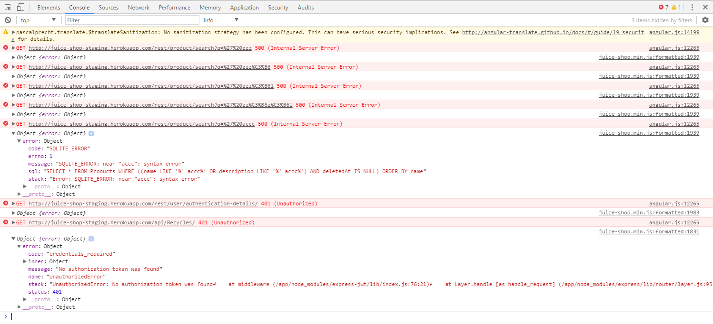
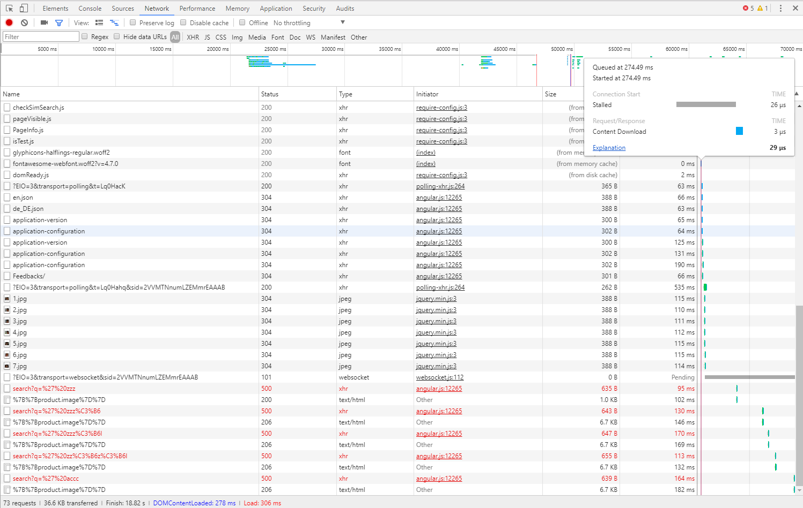
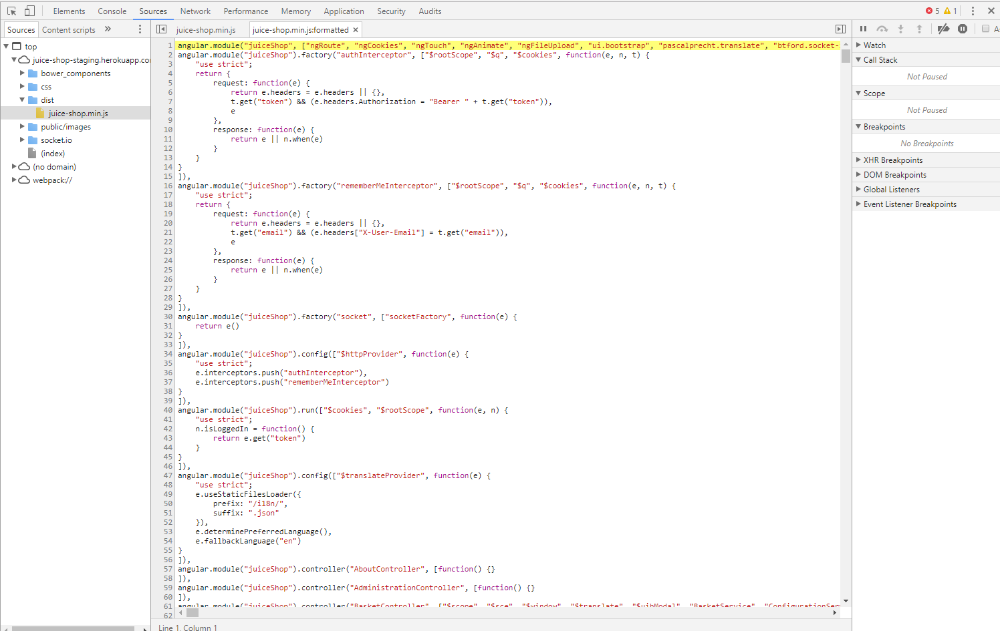
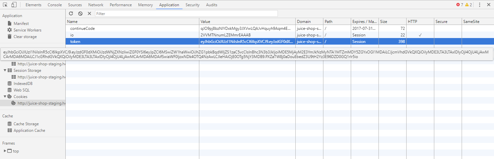
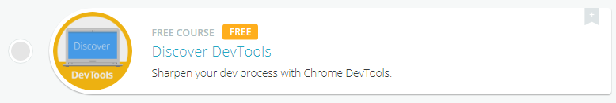
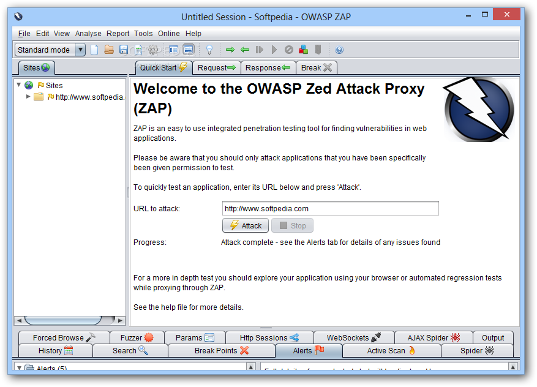
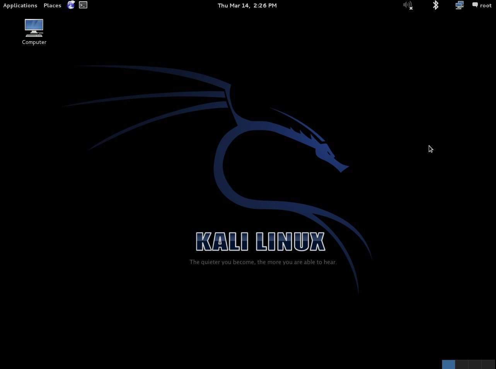

# Hacking exercise rules

## ✅ Recommended hacking tools

### Browser

When hacking a web application a good internet browser is mandatory. The emphasis lies on _good_ here, so you do _not_ want to use Internet Explorer. Other than that it is up to your personal preference. Chrome and Firefox both work fine from the authors experience.

#### Browser development toolkits

When choosing a browser to work with you want to pick one with good integrated \(or pluggable\) developer tooling. Google Chrome and Mozilla Firefox both come with powerful built-in _DevTools_ which you can open via the `F12`-key.

When hacking a web application that relies heavily on JavaScript, **it is essential to your success to monitor the** _**JavaScript Console**_ **permanently!** It might leak valuable information to you through error or debugging logs!

Other useful features of browser DevTools are their network overview as well as insight into the client-side JavaScript code, cookies and other local storage being used by the application.

If you are not familiar with the features of DevTools yet, there is a worthwhile online-learning course [Discover DevTools](https://www.codeschool.com/courses/discover-devtools) on [Code School](https://www.codeschool.com) available for free. It teaches you hands-on how Chrome's powerful developer toolkit works. The course is worth a look even if you think you know the DevTools quite well already.

#### Tools for HTTP request tampering

On the _Network_ tab of Firefox's DevTools you have the option to _Edit and Resend_ every recorded HTTP request. This is extremely useful when probing for holes in the server-side validation logic.

Request tampering plugins like [TamperData](https://addons.mozilla.org/de/firefox/addon/tamper-data/) for Firefox or [Tamper Chrome](https://chrome.google.com/webstore/detail/tamper-chrome-extension/hifhgpdkfodlpnlmlnmhchnkepplebkb) let you monitor and - more importantly - modify HTTP requests _before_ they are submitted from the browser to the server.

These can also be helpful when trying to bypass certain input validation or access restriction mechanisms, that are not properly checked _on the server_ once more.

An API testing plugin like [PostMan](https://chrome.google.com/webstore/detail/postman/fhbjgbiflinjbdggehcddcbncdddomop) for Chrome allows you to communicate with the RESTful backend of a web application directly. Skipping the UI can often be useful to circumvent client-side security mechanisms or simply get certain tasks done faster. Here you can create requests for all available HTTP verbs \(`GET`, `POST`, `PUT`, `DELETE` etc.\) with all kinds of content-types, request headers etc.

If you feel more at home on the command line, `curl` will do the trick just as fine as the recommended browser plugins.

#### Scripting tools

🔧 **TODO**

### Penetration testing tools

You _can_ solve all challenges just using a browser and the plugins/tools mentioned above. If you are new to web application hacking \(or penetration testing in general\) this is also the _recommended_ set of tools to start with. In case you have experience with professional pentesting tools, you are free to use those! And you are _completely free_ in your choice, so expensive commercial products are just as fine as open source tools. With this kind of tooling you will have a competitive advantage for some of the challenges, especially those where _brute force_ is a viable attack. But there are just as many multi-staged vulnerabilities in the **Bad Bank Shop** where - at the time of this writing - automated tools would probably not help you at all.

In the following sections you find some recommended pentesting tools in case you want to try one. Please be aware that the tools are not trivial to learn - let alone master. Trying to learn about the web application security basics _and_ hacking tools _at the same time_ is unlikely to get you very far in either of the two topics.

#### Intercepting proxies

An intercepting proxy is a software that is set up as _man in the middle_ between your browser and the application you want to attack. It monitors and analyzes all the HTTP traffic and typically lets you tamper, replay and fuzz HTTP requests in various ways. These tools come with lots of attack patterns built in and offer active as well as passive attacks that can be scripted automatically or while you are surfing the target application.

The open-source [OWASP Zed Attack Proxy \(ZAP\)](https://www.owasp.org/index.php/OWASP_Zed_Attack_Proxy_Project) is such a software and offers many useful hacking tools for free:

> ZAP is an easy to use integrated penetration testing tool for finding vulnerabilities in web applications. It is designed to be used by people with a wide range of security experience and as such is ideal for developers and functional testers who are new to penetration testing. ZAP provides automated scanners as well as a set of tools that allow you to find security vulnerabilities manually.

#### Pentesting Linux distributions

Instead of installing a tool such as ZAP on your computer, why not take it, add _several hundred_ of other offensive security tools and put them all into a ready-to-use Linux distribution? Entering [Kali Linux](https://www.kali.org) and similar toolboxes:

> Kali Linux is a Debian-based Linux distribution aimed at advanced Penetration Testing and Security Auditing. Kali contains several hundred tools aimed at various information security tasks, such as Penetration Testing, Forensics and Reverse Engineering.

The keyword in the previous quote is _advanced_! More precisely, Kali Linux is _easily overwhelming_ when beginners try to work with it, as even the Kali development team states:

> As the distribution’s developers, you might expect us to recommend that everyone should be using Kali Linux. The fact of the matter is, however, that Kali is a Linux distribution specifically geared towards professional penetration testers and security specialists, and given its unique nature, it is **NOT** a recommended distribution if you’re unfamiliar with Linux \[...\]. Even for experienced Linux users, Kali can pose some challenges.

Although there exist some more light-weight pentesting distributions, they basically still present a high hurdle for people new to the IT security field. If you still feel up to it, give Kali Linux a try!

### Internet

You are free to use Google during your hacking session to find helpful websites or tools. **The Bad Bank Shop** is leaking useful information all over the place if you know where to look, but sometimes you simply need to extend your research to the Internet in order to gain some relevant piece of intel to beat a challenge.

## 💡 Getting hints

Frankly speaking, you are reading the _premium source of hints_ right now! Congratulations! In case you want to hack more on your own than [follow the breadcrumbs through the wood of challenges in part II](../../part-ii/part-ii-challenge-hunting/), the most direct way to ask for specific hints for a particular challenge is the community chat.

## ❌ Things considered cheating

### Reading a solution before trying

You have been warned.

### Source code

The **Bad Bank Shop** is supposed to be attacked in a "black box" manner. That means you cannot look into the source code to search for vulnerabilities. As the application tracks your successful attacks on its challenges, the code must contain checks to verify if you succeeded. These checks would give many solutions away immediately.

The same goes for several other implementation details, where vulnerabilities were arbitrarily programmed into the application. These would be obvious when the source code is reviewed.

Finally the end-to-end test suite of **Bad Bank** was built hack all challenges automatically, in order to verify they can all be solved. These tests deliver all the required attacks on a silver plate when reviewed.

### GitHub repository

While stated earlier that "the Internet" is fine as a helpful resource, consider the GitHub repository as entirely off limits. First and foremost because it contains the source code \(see above\).

### Database table `Challenges`

The challenges \(and their progress\) live in one database together with the rest of the application data, namely in the `Challenges` table. Of course you could "cheat" by simply editing the state of each challenge from _unsolved_ to _solved_ by setting the corresponding `solved` column to `1`. You then just have to keep your fingers crossed, that nobody ever asks you to _**demonstrate how**_ **you actually solved all the 4- and 5-star challenges so quickly**.

### Configuration REST API Endpoint

🔧 **TODO**

### Score Board HTML/CSS

The Score Board and its features were covered in the [Challenge tracking](https://github.com/MrBoy31/pwning-bb-wargames/tree/f91da0f4e2fc196c7c04ea1c9ac3fd4dac131a54/part1/challenges.md) chapter. In the current context of "things you should not use" suffice it to say, that you could manipulate the score board in the web browser to make challenges _appear as solved_. Please be aware that this "cheat" is even easier \(and more embarrassing\) to uncover in a classroom training than the previously mentioned database manipulation: A simple reload of the score board URL will let all your local CSS changes vanish in a blink and reveal your _real_ hacking progress.

